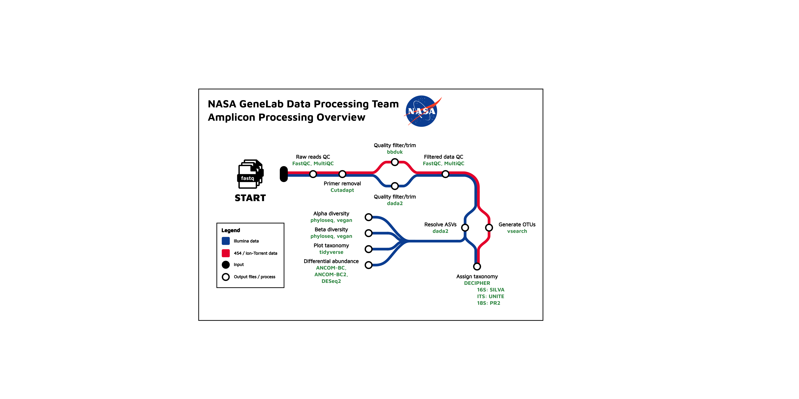

# GeneLab Amplicon Illumina Sequencing Data Processing Workflow

> GeneLab, part of NASA's [Open Science Data Repository (OSDR)](https://www.nasa.gov/osdr/), has wrapped each step of the Illumina amplicon sequencing data processing pipeline ([AmpIllumina](https://github.com/nasa/GeneLab_Data_Processing/tree/master/Amplicon)), starting with pipeline version C, into a Nextflow workflow. This repository contains information about the workflow along with instructions for installation and usage. Exact workflow run info and AmpIllumina version used to process specific datasets hosted on the [OSDR data repository](https://osdr.nasa.gov/bio/repo/) are provided alongside their processed data in OSDR under 'Files' -> 'GeneLab Processed Diversity Amplicon Files' -> 'Processing Info'. 

<br>

<p align="center">
<a href="images/GL-amplicon-subwayplot.pdf"></a>
</p>

<br>

## General Workflow Info

### Implementation Tools

The current GeneLab Illumina amplicon sequencing data processing pipeline (AmpIllumina), [GL-DPPD-7104-D.md](https://github.com/nasa/GeneLab_Data_Processing/blob/master/Amplicon/Illumina/Pipeline_GL-DPPD-7104_Versions/GL-DPPD-7104-D.md), is implemented as a [Nextflow](https://nextflow.io/) DSL2 workflow and utilizes [Singularity](https://docs.sylabs.io/guides/3.10/user-guide/introduction.html) containers, [Docker](https://docs.docker.com/get-started/) containers, or [conda](https://docs.conda.io/en/latest/) environments to install/run all tools. This workflow is run using the command line interface (CLI) of any unix-based system.  While knowledge of creating workflows in Nextflow is not required to run the workflow as is, [the Nextflow documentation](https://nextflow.io/docs/latest/index.html) is a useful resource for users who want to modify and/or extend this workflow.   

### Resource Requirements <!-- omit in toc -->

The table below details the default maximum resource allocations for individual Nextflow processes.

| CPU Cores | Memory |
|-------------------|----------------|
| 2                 | 5 GB           |

> **Note:** These per-process resource allocations are defaults. They can be adjusted by modifying `cpus` and `memory` directives in the configuration file: [`nextflow.config`](workflow_code/nextflow.config).

<br>

## Utilizing the Workflow

1. [Install Nextflow, Singularity, and Conda](#1-install-nextflow-singularity-and-conda)  
   1a. [Install Nextflow and Conda](#1a-install-nextflow-and-conda)  
   1b. [Install Singularity](#1b-install-singularity)  

2. [Download the Workflow Files](#2-download-the-workflow-files)  

3. [Fetch Singularity Images](#3-fetch-singularity-images)  

4. [Run the Workflow](#4-run-the-workflow)  
   4a. [Approach 1: Start with OSD or GLDS accession as input](#4a-approach-1-start-with-an-osd-or-glds-accession-as-input)  
   4b. [Approach 2: Start with a runsheet csv file as input](#4b-approach-2-start-with-a-runsheet-csv-file-as-input)  
   4c. [Approach 3: Run the workflow using an ISA Archive](#4c-approach-3-run-the-workflow-using-an-isa-archive)  
   4d. [Modify parameters and compute resources in the Nextflow config file](#4c-modify-parameters-and-compute-resources-in-the-nextflow-config-file)  

5. [Workflow Outputs](#5-workflow-outputs)  
   5a. [Main outputs](#5a-main-outputs)  
   5b. [Resource logs](#5b-resource-logs)  

6. [Post-processing](#6-post-processing)  

<br>

---

### 1. Install Nextflow, Singularity, and Conda

#### 1a. Install Nextflow and Conda

Nextflow can be installed either through the [Anaconda bioconda channel](https://anaconda.org/bioconda/nextflow) or as documented on the [Nextflow documentation page](https://www.nextflow.io/docs/latest/getstarted.html).

> Note: If you wish to install conda, we recommend installing a Miniforge version appropriate for your system, as documented on the [conda-forge website](https://conda-forge.org/download/), where you can find basic binaries for most systems. More detailed miniforge documentation is available in the [miniforge github repository](https://github.com/conda-forge/miniforge).
> 
> Once conda is installed on your system, you can install the latest version of Nextflow by running the following commands:
> 
> ```bash
> conda install -c bioconda nextflow
> nextflow self-update
> ```
> You may also install [mamba](https://mamba.readthedocs.io/en/latest/index.html) first which is a faster implementation of conda and can be used as a drop-in replacement:
> ```bash
> conda install -c conda-forge mamba
> ```

<br>

#### 1b. Install Singularity

Singularity is a container platform that allows usage of containerized software. This enables the GeneLab workflow to retrieve and use all software required for processing without the need to install the software directly on the user's system.

We recommend installing Singularity on a system wide level as per the associated [documentation](https://docs.sylabs.io/guides/3.10/admin-guide/admin_quickstart.html).

> Note: Singularity is also available through the [Anaconda conda-forge channel](https://anaconda.org/conda-forge/singularity).

> Note: Alternatively, Docker can be used in place of Singularity. To get started with Docker, see the [Docker CE installation documentation](https://docs.docker.com/engine/install/).

<br>

---

### 2. Download the Workflow Files

All files required for utilizing the NF_AmpIllumina GeneLab workflow for processing amplicon Illumina data are in the [workflow_code](workflow_code) directory. To get a copy of the latest *NF_AmpIllumina* version on to your system, the code can be downloaded as a zip file from the release page then unzipped after downloading by running the following commands: 

```bash
wget https://github.com/nasa/GeneLab_AmpliconSeq_Workflow/releases/download/v1.0.9/NF_AmpIllumina_1.0.9.zip
unzip NF_AmpIllumina_1.0.9.zip && cd NF_AmpIllumina_1.0.9
```

<br>

---

### 3. Fetch Singularity Images

Although Nextflow can fetch Singularity images from a url, doing so may cause issues as detailed [here](https://github.com/nextflow-io/nextflow/issues/1210).

To avoid this issue, run the following command to fetch the Singularity images prior to running the NF_AmpIllumina workflow:

> Note: This command should be run in the location containing the `NF_AmpIllumina_1.0.9` directory that was downloaded in [step 2](#2-download-the-workflow-files) above. Depending on your network speed, fetching the images will take ~20 minutes. Approximately 4GB of RAM is needed to download and build the Singularity images.

```bash
bash ./bin/prepull_singularity.sh nextflow.config
```

Once complete, a `singularity` folder containing the Singularity images will be created. Run the following command to export this folder as a Nextflow configuration environment variable to ensure Nextflow can locate the fetched images:

```bash
export NXF_SINGULARITY_CACHEDIR=$(pwd)/singularity
```

<br>

---

### 4. Run the Workflow

> ***Note:** All the commands in this step assume that the workflow will be run from within the `NF_AmpIllumina_1.0.9` directory that was downloaded in [step 2](#2-download-the-workflow-files) above. They may also be run from a different location by providing the full path to the main.nf workflow file in the `NF_AmpIllumina_1.0.9` directory.*
<<<<<<< HEAD

For options and detailed help on how to run the workflow, run the following command:

```bash
nextflow run main.nf --help
```
=======
>>>>>>> 1.0.9 docs update

> Note: Nextflow commands use both single hyphen arguments (e.g. -help) that denote general Nextflow arguments and double hyphen arguments (e.g. --input_file) that denote workflow specific parameters.  Take care to use the proper number of hyphens for each argument.

<br>

#### 4a. Approach 1: Start with OSD or GLDS accession as input

```bash
nextflow run main.nf \
   -resume \
   -profile singularity \
   --target_region 16S \
   --accession OSD-487 
```

<br>

#### 4b. Approach 2: Start with a runsheet csv file as input

```bash
nextflow run main.nf \
   -resume \
   -profile singularity \
   --target_region 16S \
   --input_file PE_file.csv \
   --F_primer AGAGTTTGATCCTGGCTCAG \
   --R_primer CTGCCTCCCGTAGGAGT 
```

<br>

#### 4c. Approach 3: Run the workflow using an ISA Archive

> Note: Specifications for the ISA Tab Archive format can be found [here](https://isa-specs.readthedocs.io/en/latest/isatab.html).

```bash
nextflow run main.nf \
   -resume \
   -profile singularity \
   --target_region 16S \
   --accession OSD-487
   --isa_archive </path/to/isaArchive> 
```

<br>


**Required Parameters For All Approaches:**

* `main.nf` - Instructs Nextflow to run the NF_AmpIllumina workflow. If running in a directory other than `NF_AmpIllumina_1.0.9`, replace with the full path to the NF_AmpIllumina main.nf workflow file.
* `-resume` - Resumes  workflow execution using previously cached results
* `-profile` – Specifies the configuration profile(s) to load (multiple options can be provided as a comma-separated list)
   * Software environment profile options (choose one):
      * `singularity` - instructs Nextflow to use Singularity container environments
      * `docker` - instructs Nextflow to use Docker container environments
      * `conda` - instructs Nextflow to use conda environments via the conda package manager
        > *Note: By default, Nextflow will create environments at runtime using the yaml files in the [workflow_code/envs](workflow_code/envs/) folder. You can change this behavior by using the `--conda_*` workflow parameters or by editing the [nextflow.config](workflow_code/nextflow.config) file to specify a centralized conda environments directory via the `conda.cacheDir` parameter.*
      * `mamba` - instructs Nextflow to use conda environments via the mamba package manager 
   * Other option (can be combined with the software environment option above using a comma, e.g. `-profile slurm,singularity`):
      * `slurm` - instructs Nextflow to use the [Slurm cluster management and job scheduling system](https://slurm.schedmd.com/overview.html) to schedule and run the jobs on a Slurm HPC cluster
* `--target_region` - Specifies the amplicon target region to be analyzed (type: string, options: 16S, 18S, or ITS, default: 16S)


**Additional Required Parameters For [Approach 1](#4a-approach-1-start-with-an-osd-or-glds-accession-as-input)**   

* `--accession` - The OSD or GLDS accession number specifying the [OSDR](https://osdr.nasa.gov/bio/repo/) dataset to process, e.g. OSD-487 or GLDS-487 (type: string, default: null)
  > *Note: Not all datasets have the same OSD and GLDS number, so make sure the correct OSD or GLDS number is specified*


**Additional Required Parameters For [Approach 2](#4b-approach-2-start-with-a-runsheet-csv-file-as-input):** 

* `--input_file` –  A single-end or paired-end runsheet csv file containing assay metadata for each sample, including sample_id, forward (path to forward read), [reverse (path to reverse read, for paired-end only),] paired (boolean, TRUE | FALSE), groups (specifies sample treatment group name). Please see the [runsheet documentation](./examples/runsheet) in this repository for examples on how to format this file. (type: string, default: null)

* `--F_primer` - Forward primer sequence (type: string, default: null)

* `--R_primer` - Reverse primer sequence (type: string, default: null)


**Additional Required Parameters For [Approach 3](#4c-approach-3-run-the-workflow-using-an-isa-archive):**

* `--accession` – The OSD or GLDS accession number specifying the [OSDR](https://osdr.nasa.gov/bio/repo/) dataset to process, e.g. OSD-487 or GLDS-487 (type: string, default: null)
  > *Note: Not all datasets have the same OSD and GLDS number, so make sure the correct OSD or GLDS number is specified*

* `--isa_archive` - specifies the path to a previously-downloaded *ISA.zip (type, string, default: null (an *ISA.zip is automatically fetched from the GeneLab Repository for the OSDR dataset being processed)) 

<br>


**Optional Parameters For All Approaches**

* `--outdir` - Specifies the base directory where the output directories will be created (type: string, default: "${launchDir}")
* `--trim_primers` - Whether primers should be trimmed (type: boolean, default: true)
* `--min_cutadapt_len` - Minimum length of reads to keep after Cutadapt trimming (type: integer, default: 130) 
* `--discard_untrimmed` - Whether to discard untrimmed reads (type: boolean, default: true)
* `--left_trunc` - Truncate forward reads after this many bases. Reads shorter than this are discarded (type: integer, default: 0)
* `--right_trunc` - Truncate reverse reads after this many bases. Reads shorter than this are discarded (type: integer, default: 0)
* `--left_maxEE` - Maximum expected errors allowed in forward reads (type: integer, default: 1)
* `--right_maxEE` - Maximum expected errors allowed in reverse reads (type: integer, default: 1)
* `--output_prefix` - Prefix to add to output filenames, e.g. "Study1_". If the string is not empty and does not end with '_' or '-', an underscore will be automatically appended (type: string, default: "")
* `--assay_suffix` - Suffix to add to output filenames (type: string, default: "_GLAmpSeq" that can be prepended with "\_<target_region>")
* `--force_single_end` - Force single-end mode by specifying which read to use (type: string, options: "R1" or "R2", default: null)

<br>


**Additional Optional Parameters**

The parameters listed above and more optional arguments for the AmpIllumina workflow, including but not limited to input/output options, trimming/filtering options, and debug-related and conda-related options that may not be immediately useful for most users, can be viewed by running the following command:

```bash
nextflow run main.nf --help
```

See `nextflow run -h` and [Nextflow's CLI run command documentation](https://nextflow.io/docs/latest/cli.html#run) for more options and details common to all nextflow workflows.

<br>


#### 4d. Modify parameters and compute resources in the Nextflow config file

Additionally, all parameters and workflow resources can be directly specified in the [nextflow.config](./workflow_code/nextflow.config) file. For detailed instructions on how to modify and set parameters in the config file, please see the [documentation here](https://www.nextflow.io/docs/latest/config.html).

Once you've downloaded the workflow template, you can modify the parameters in the `params` scope and cpus/memory requirements in the `process` scope in your downloaded version of the [nextflow.config](workflow_code/nextflow.config) file as needed in order to match your dataset and system setup. Additionally, if necessary, you can modify each variable in the [nextflow.config](workflow_code/nextflow.config) file to be consistent with the study you want to process and the computer you're using for processing.

<br>

---

### 5. Workflow Outputs

#### 5a. Main Outputs

The outputs from this pipeline are documented in the [GL-DPPD-7104-D](https://github.com/nasa/GeneLab_Data_Processing/blob/master/Amplicon/Illumina/Pipeline_GL-DPPD-7104_Versions/GL-DPPD-7104-D.md) processing protocol.

Additional outputs are described below:
- GeneLab/software_versions_<assay_suffix>.txt (version capturing file for all tools and packages used in the pipeline)
- **Approach 1-specific:**
    - Metadata/\*_amplicon\_<target_region>_v3_runsheet.csv (table containing metadata required for processing, including the raw reads files location)
    - Metadata/\*-ISA.zip (the ISA archive of the OSD datasets to be processed, downloaded from the OSDR)
    - Metadata/GLfile.csv (parsed from *runsheet.csv to match format of <input_file> from Approach 2)
- **Approach 2-specific:**
    - Metadata/\<input_file> (the runsheet csv file used to run Approach 2)

#### 5b. Resource Logs

Standard Nextflow resource usage logs are also produced as follows:

**Nextflow Resource Usage Logs**
   - Resource_Usage/execution_report_{timestamp}.html (an html report that includes metrics about the workflow execution including computational resources and exact workflow process commands)
   - Resource_Usage/execution_timeline_{timestamp}.html (an html timeline for all processes executed in the workflow)
   - Resource_Usage/execution_trace_{timestamp}.txt (an execution tracing file that contains information about each process executed in the workflow, including: submission time, start time, completion time, cpu and memory used, machine-readable output)

> Further details about these logs can also found within [this Nextflow documentation page](https://www.nextflow.io/docs/latest/tracing.html#execution-report).

<br>

---

### 6. Post-processing

> Please note that to run the post-processing workflow successfully, you MUST run the processing workflow above via the [launch.sh](workflow_code/launch.sh) script first. Please see the [script](workflow_code/launch.sh) for how to run it and make sure to edit the place holders before running it.

The post-processing workflow is designed to validate processed data generated by the main workflow, package processing information, purge file paths when necessary, and generate file association table suitable for uploading to OSDR, in addition to other output files, such as README, protocol, and md5sums tables.

To generate the post-processing files after running the main processing workflow successfully, modify and set the parameters in [post_processing.config](workflow_code/post_processing.config), then run the following command:

```bash
nextflow -C post_processing.config \
   run post_processing.nf \
   -resume \
   -profile singularity
``` 

For more details on the parameters for the post-processing workflow, run the following command:

```bash
nextflow -C post_processing.config run post_processing.nf --help
```

> Note: When running the post-processing workflow, make sure the `-C post_processing.config` flag (capital C) is placed before the `run` command, as Nextflow requires configuration flags to precede the run subcommand. Using capital `-C` ensures that Nextflow disregards the default `nextflow.config` and uses only `post_processing.config`.


**Post processing workflow output files** 
> *Note: The outputs are saved in a directory called `GeneLab` under `<outdir>`*
 - <GLDS_accession>_associated-file-names\_<assay_suffix>.tsv (File association table for OSDR curation)
 - <GLDS_accession>_amplicon-validation.log (Automated verification and validation log file)
 - processed_md5sum_<assay_suffix>.tsv (md5sums for the processed files published on OSDR)
 - raw_md5sum_<assay_suffix>.tsv (md5sums for the raw files published on OSDR, optional)
 - processing_info_<assay_suffix>.zip  (Zip file containing all files used to run the workflow and required logs with paths purged) 
 - protocol.txt  (File describing the methods used by the workflow)
 - README_<assay_suffix>.txt (README file listing and describing the outputs of the workflow)

<br>

---

## License

The software for the Amplicon Seq workflow is released under the [NASA Open Source Agreement (NOSA) Version 1.3](License/Amplicon_NOSA_License.pdf).


### 3rd Party Software Licenses

Licenses for the 3rd party open source software utilized in the Amplicon Seq workflow can be found in the [3rd_Party_Licenses sub-directory](License/3rd_Party_Licenses). 

<br>

---

## Notices

Copyright © 2021 United States Government as represented by the Administrator of the National Aeronautics and Space Administration.  All Rights Reserved.

### Disclaimers

No Warranty: THE SUBJECT SOFTWARE IS PROVIDED "AS IS" WITHOUT ANY WARRANTY OF ANY KIND, EITHER EXPRESSED, IMPLIED, OR STATUTORY, INCLUDING, BUT NOT LIMITED TO, ANY WARRANTY THAT THE SUBJECT SOFTWARE WILL CONFORM TO SPECIFICATIONS, ANY IMPLIED WARRANTIES OF MERCHANTABILITY, FITNESS FOR A PARTICULAR PURPOSE, OR FREEDOM FROM INFRINGEMENT, ANY WARRANTY THAT THE SUBJECT SOFTWARE WILL BE ERROR FREE, OR ANY WARRANTY THAT DOCUMENTATION, IF PROVIDED, WILL CONFORM TO THE SUBJECT SOFTWARE. THIS AGREEMENT DOES NOT, IN ANY MANNER, CONSTITUTE AN ENDORSEMENT BY GOVERNMENT AGENCY OR ANY PRIOR RECIPIENT OF ANY RESULTS, RESULTING DESIGNS, HARDWARE, SOFTWARE PRODUCTS OR ANY OTHER APPLICATIONS RESULTING FROM USE OF THE SUBJECT SOFTWARE.  FURTHER, GOVERNMENT AGENCY DISCLAIMS ALL WARRANTIES AND LIABILITIES REGARDING THIRD-PARTY SOFTWARE, IF PRESENT IN THE ORIGINAL SOFTWARE, AND DISTRIBUTES IT "AS IS."

Waiver and Indemnity:  RECIPIENT AGREES TO WAIVE ANY AND ALL CLAIMS AGAINST THE UNITED STATES GOVERNMENT, ITS CONTRACTORS AND SUBCONTRACTORS, AS WELL AS ANY PRIOR RECIPIENT.  IF RECIPIENT'S USE OF THE SUBJECT SOFTWARE RESULTS IN ANY LIABILITIES, DEMANDS, DAMAGES, EXPENSES OR LOSSES ARISING FROM SUCH USE, INCLUDING ANY DAMAGES FROM PRODUCTS BASED ON, OR RESULTING FROM, RECIPIENT'S USE OF THE SUBJECT SOFTWARE, RECIPIENT SHALL INDEMNIFY AND HOLD HARMLESS THE UNITED STATES GOVERNMENT, ITS CONTRACTORS AND SUBCONTRACTORS, AS WELL AS ANY PRIOR RECIPIENT, TO THE EXTENT PERMITTED BY LAW.  RECIPIENT'S SOLE REMEDY FOR ANY SUCH MATTER SHALL BE THE IMMEDIATE, UNILATERAL TERMINATION OF THIS AGREEMENT.
